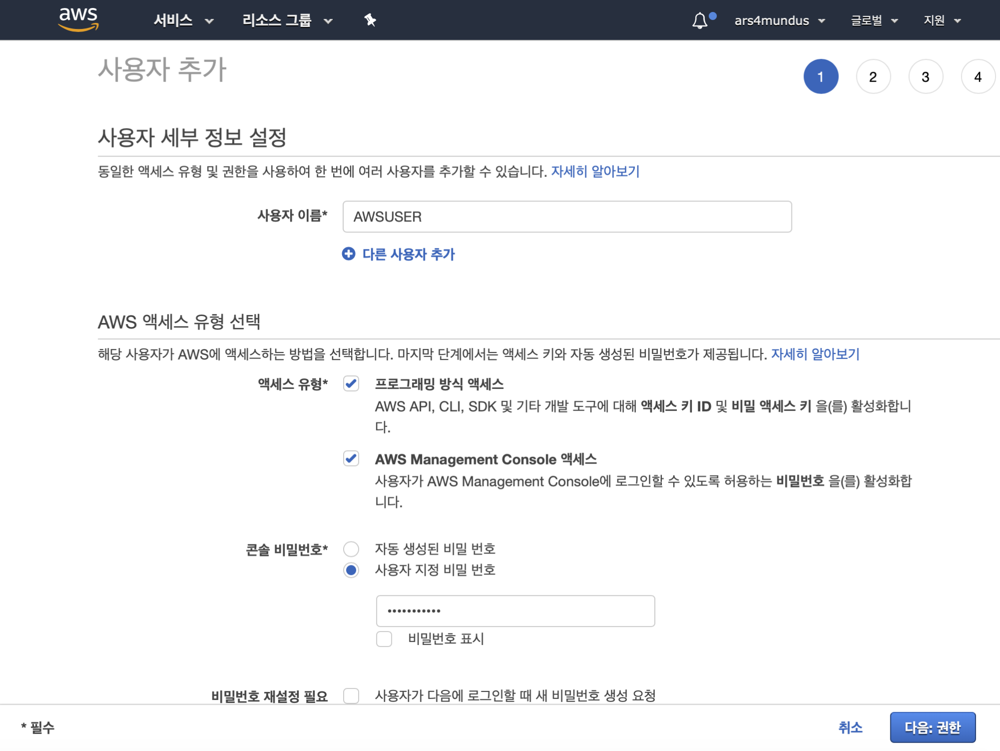
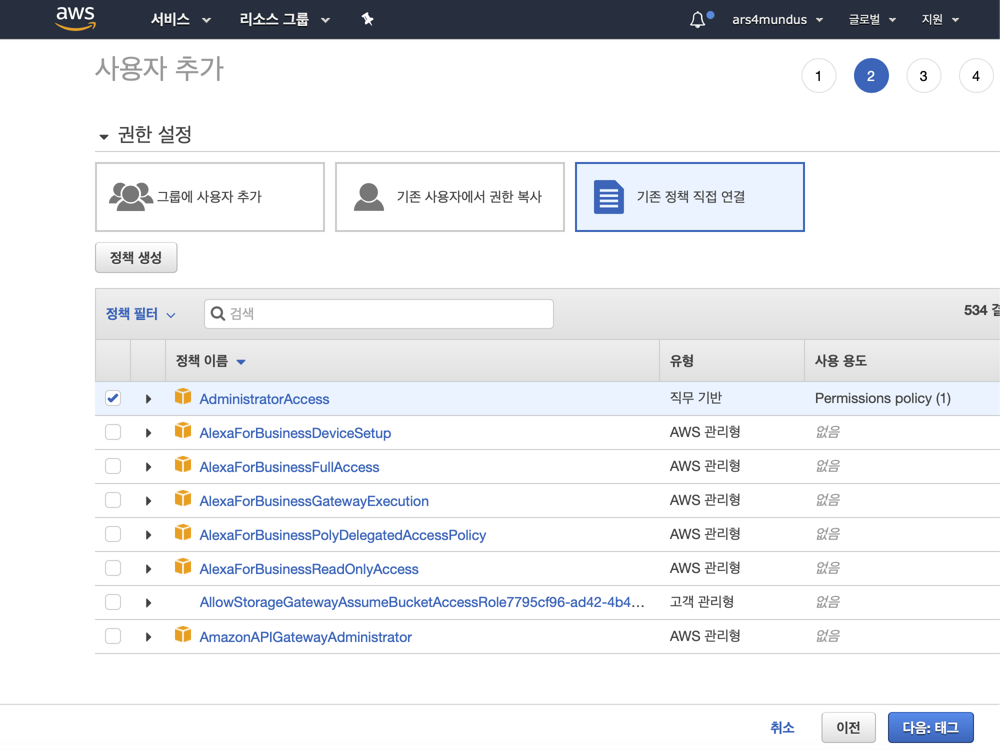
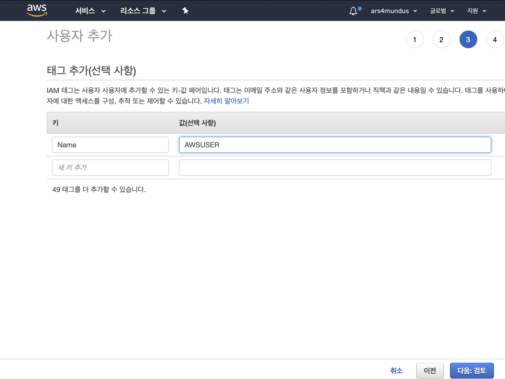
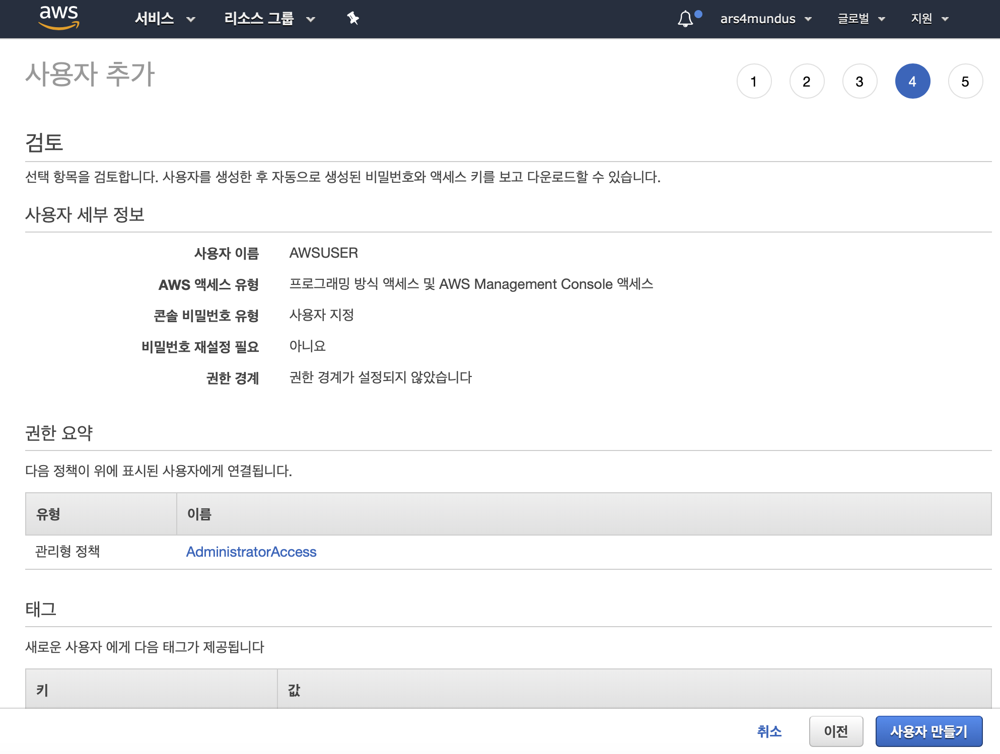

# 실습 1.1: AWS CLI 사용

#### 실습 전에 AWS 계정을 만들고, 콘솔에 로그인한다. 서비스 찾기 창에 IAM을 입력하고 검색된 IAM을 클릭한다.
 

#### 왼쪽 메뉴에서 사용자를 클릭한다.

 
#### [사용자 추가]를 클릭한다.

#### ‘사용자 이름’을 입력하고 ‘AWS 액세스 유형’에서 ‘프로그래밍 방식 액세스’와 ‘AWS Management Console 액세스’ 체크박스를 모두 클릭한다. 비밀번호를 지정하고 [다음:권한]을 클릭한다.

#### [기존 정책 직접 연결]을 클릭’하고, ‘Administrator Access’를  체크 한다.(관리자 권한 부여) [다음:태그]를 클릭한다.

#### 태크 키와 값에 임의의 값을 입력하거나 무시하고 [다음:검토]를 클릭한다.

#### [사용자 만들기]를 클릭한다.

